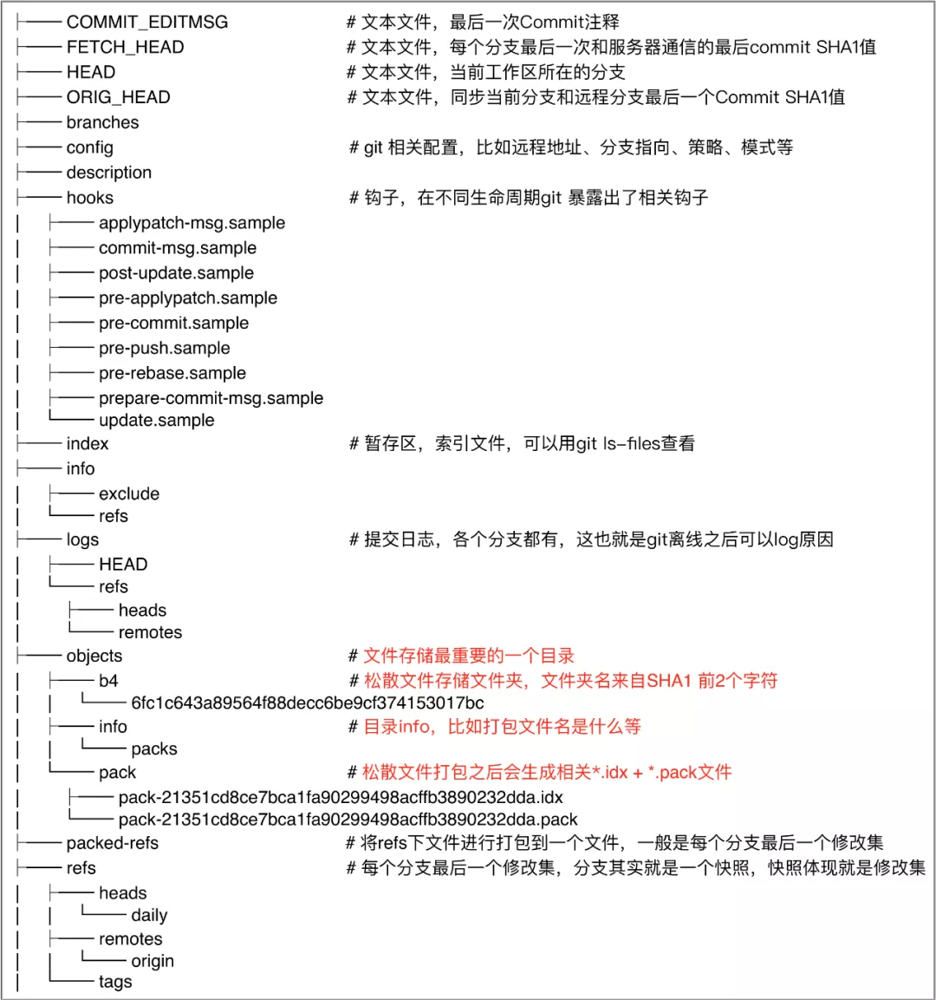
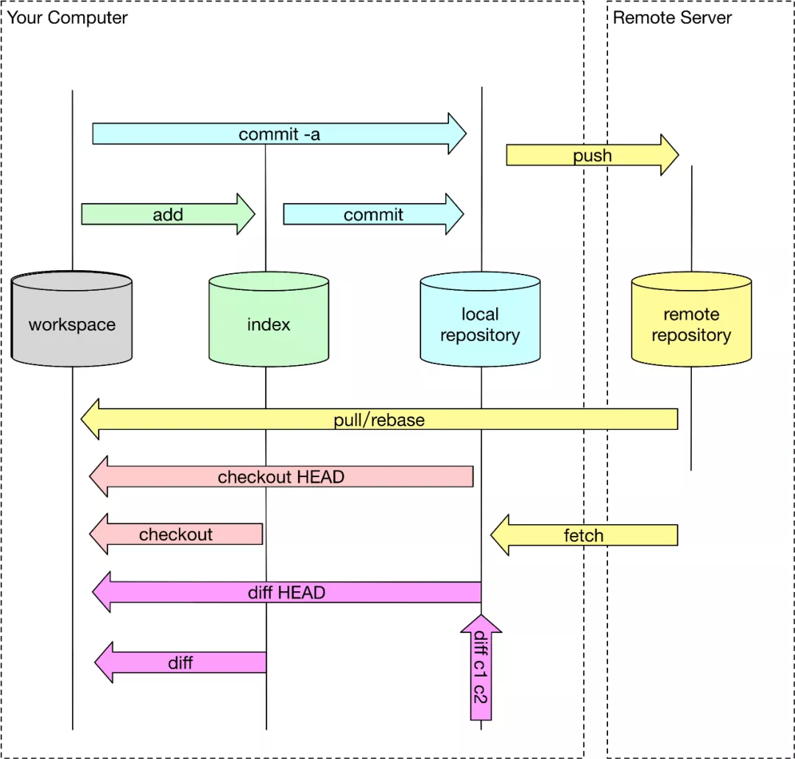

# 深入理解git的实现原理

## 总结：

1. git使用git数据库来保存**实体文件内容（blob对象），tree对象，commit对象，tag对象**（变更前后内容各保存一份）（键值对，hash值（SHA-1）来作为文件内容的一一对应）
2. 对象
   1. blob：二进制
   2. tree：树结构（子节点（tree），根节点（blob））
   3. commit：链表，（parent，tree）
   4. tag：轻量级（git tag tagName，本质commit对象）重量级（git tag -a tagName -m''本质tag对象）

## 前置文章

>https://www.cnblogs.com/mamingqian/articles/9711975.html（原理）
>
>http://mp.weixin.qq.com/s?__biz=MzIzOTU0NTQ0MA==&mid=2247496082&idx=1&sn=4995262c811e73119189174969e53ff2&chksm=e92acc9dde5d458b2ab75321a684a5a6229c6d323fc332a75a2d2b0136e9f28a2a60f6d8f657&mpshare=1&scene=23&srcid=0607bLE95jdYDgbvXRR9A8OM&sharer_sharetime=1591527533836&sharer_shareid=741c5e4304f8d071be54cfdc23f95766#rd（深化）

## 问题

1. git是什么？
2. git能够解决哪些问题？
3. git的实现原理？

## git是什么

**分布式版本控制系统**

1. 分布式：git的数据（本地，服务器）
2. 集中式（svn）:数据（服务器）

## git能够解决哪些问题

原理：**存储文件变更过程**（**版本状态存储**）

怎么存储（git数据库），怎么使用（命令）

## git的实现原理

1. **git数据库（内容变更）**
2. **文件变更**
3. **SHA-1、hash值(键值对)**
4. 分支-git的引用(.git/refs)

**对象：blob，tree，commit**

1. blob:存储文件内容
2. tree:存储文件结构
3. commit:存储提交内容

### git数据库

#### 实际位置

`git/objects`

#### 命令行命令

1. 写入：`git hash-object `  -w(写入)  ：返回长度为40位的hash值

   ```
   //"|"表示这是一条通道命令，意思是把“|”前边的命令的输出作为“|”后边命令的输入。git hash-object -w --stdin 的意思是向git数据库中写入一条数据（-w）,这条数据的内容从标准输入中读取（--stdin）。
   $ echo "version 1" | git hash-object -w --stdin
   
   //文件内容写入git数据库
   $ echo "version 1" > file.txt
   $ git hash-object -w file.txt
   
   备注：返回值举例(83baae61804e65cc73a7201a7252750c76066a30)
   ```

2. 查询：`git cat-file`   返回对象类型（-t） 内容（-p）

   ```
   -t (查看对象类型)，-p(查看对象内容)
   //-t选项用于查看键值对应数据的类型，-p选项用于查看键值对应的数据内容，83bba为数据键值的简写。
   $ git cat-file -t  83baa
   $ git cat-file -p 83baa
   ```

3. 不重要命令

     ```
   1. 列举指定文件夹下内容（find）
   	a. $ find .git/objects/ -type f
   	b. $ find .git/index
   2. 创建暂存区(git update-index)
   	a. $ git update-index --add file.txt
   3. 查看暂存区内容(git ls-files --stage)
   4. 将暂存区内容写入一个树对象(git write-tree)
   5. 将创建的树对象提交为commit 对象($ git commit-tree)
   	a. $ git write-tree
       b. $ git commit-tree cb0fbcc(tree的hash) -m "first commit"
   6. 查看最近一个提交对象的提交记录(git log)
   ```


## 文件结构



## 状态模型



### 工作区 (workspace)

### 暂存区 (index)

### 本地仓库 (local repository)

### 远程仓库 (remote repository)